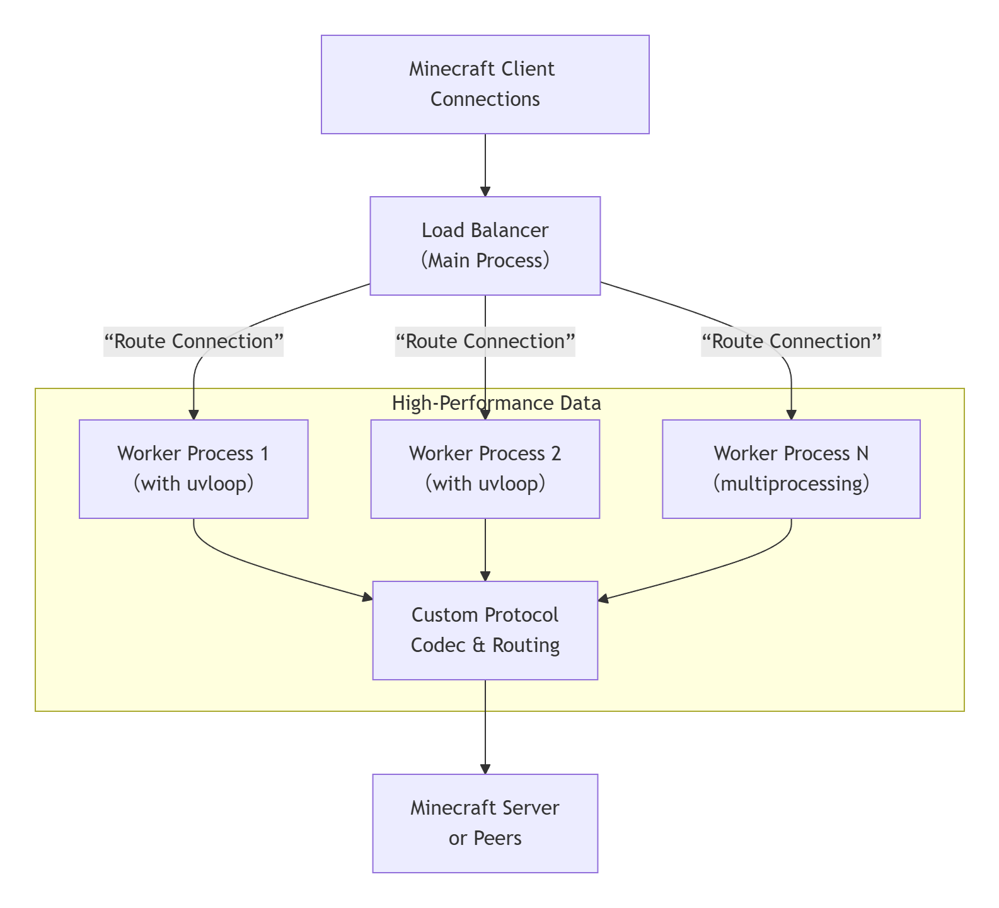
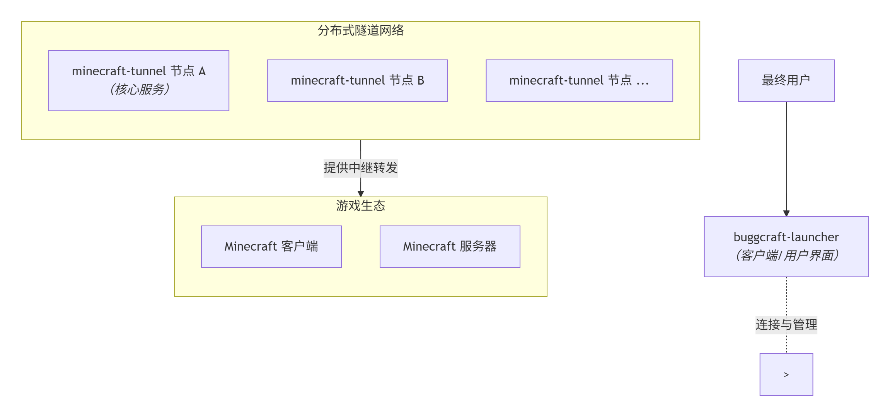

# minecraft-tunnel

> 专为 Minecraft 打造的高性能、分布式联机隧道网络核心。旨在彻底解决玩家在跨网络联机时面临的技术壁垒。

## 🌐 项目愿景

让任何地方的 Minecraft 玩家，都能与好友建立稳定、低延迟的联机连接，无需复杂的网络配置。我们通过构建一个去中心化的隧道网络，将联机体验简化为“一键连接”。

## ✨ 核心特性

**隧道网络核心 (minecraft-tunnel)**

这才是本项目真正的技术心脏。

* **​无公网IP联机​​：** 基于先进的隧道中继技术，实现穿透 NAT/防火墙的直连体验。
* ​**​低延迟传输​​：** 针对 Minecraft 游戏数据包特性进行优化，智能选择最优网络路径。
* ​**​大规模并发​​：** 服务端设计支持数千玩家同时在线，具备高可用性和负载均衡能力。
* ​**​分布式架构​​：** 允许社区成员部署公共隧道节点，共同构建一个健壮、可扩展的联机生态。
* **安全可靠​​：** 支持游戏房间的密码保护、权限控制和连接会话持久化。

**[启动器应用 (buggcraft-launcher)](https://github.com/vdjango/buggcraft)**

作为隧道网络的客户端，它展示了如何将强大的隧道能力转化为极致的用户体验。

* **​一键创建/加入房间​​：** 复杂的隧道技术在后台自动完成，用户只需一个按钮。
* ​**​智能环境同步​​：** 主机可打包并分发模组列表和配置，确保所有玩家客户端版本一致。
* ​**​现代化界面​​：** 提供符合 Minecraft 美学的直观操作界面。
* ​**​轻量化设计​​：** 核心功能体积小巧，启动迅速。

## 🏗 架构概述

本项目的核心 minecraft-tunnel 采用了高性能网络服务的经典架构，旨在为大规模、低延迟的 Minecraft 联机提供坚实的底层支持。
采用 ​​**uvloop + asyncio + multiprocessing + 自定义协议**​​ 的技术栈，构建了一个高性能、可扩展的分布式隧道网络，以应对高并发、低延迟的联机场景。

这项技术的协同工作方式如下图所示，共同构成了一个高效的数据平面：



具体来说，每个组件的角色和优势如下：

​**​高性能事件循环: uvloop(替代 asyncio默认循环)​​**

* **​角色​​：** 作为 asyncio事件循环的极速替代，它是每个工作进程的“发动机”。
* **​​优势​​：** 使用 libuv 库，其性能接近 Go 语言级别。它极大地提升了异步任务的调度效率和网络 I/O 的处理速度，是支撑单进程万级并发连接的基石。

**异步编程框架: asyncio​​**

* ​**​角色​​：** 提供标准的异步编程范式。
* ​**​优势​​：** 允许我们使用 async/await语法编写清晰、高效的异步代码。单线程内即可处理海量网络连接，避免了传统同步阻塞模型的多线程开销，极大提升了 CPU 和内存的利用率。

**多核利用与隔离: multiprocessing​​**

* **​角色​​：** 解决 Python GIL (全局解释器锁) 对多核计算的限制，实现真正的并行处理。
* **​​优势​​：** 主进程作为负载均衡器和管理器，动态创建多个独立的工作进程（每个进程都运行着一个 uvloop实例），将连接均匀分摊到所有 CPU 核心上。这不仅实现了水平扩展，更关键的是保证了单个进程的崩溃不会影响整体服务，确保了系统的高可用性。

**通信效率优化: 自定义应用层协议​​**

* ​**​角色​​：** 在 TCP/UDP 基础之上，为 Minecraft 联机量身定制的“语言”。
* ​**​优势​​：** 对原版 Minecraft 数据包进行精简、封装和优化。支持数据包压缩、加密、快速重连和心跳保活等机制，有效减少传输冗余，显著降低联机延迟和抖动。

​​总结​​：这四项技术环环相扣，共同构建了一个资源占用少、吞吐量高、延迟低的现代网络服务架构。uvloop 和 asyncio 确保了 **​​单进程内部的极致效率​**​，multiprocessing实现了 **​​多核资源的充分利用和故障隔离​**​，而​​自定义协议​​则保证了 **​​数据传输的最优路径和质量​​。** 最终，这一切复杂的技术对玩家而言都化为简单流畅的 **“一键联机”** 体验。

### 🧩 项目组成与架构

本项目由俩个核心组件构成，共同协作以提供完整的 Minecraft 联机解决方案。其协作关系如下图所示：



**​1. minecraft-tunnel(隧道核心服务 / 后端)​​**

这是整个系统的**​​技术心脏​**​，一个独立的高性能、分布式隧道代理服务。

* **​​核心职责​​：** 专门负责在 Minecraft 客户端和目标服务器（或其他客户端）之间建立稳定、高效的中继隧道，实现网络穿透和无感知的跨网络连接。
* ​**​技术特点​​：** 
  * **​高性能架构​​：** 采用 **​​uvloop + asyncio + multiprocessing​​** 模型，充分利用多核CPU资源，单节点即可处理数万级并发连接。
  * ​**​智能路由​​：** 内置负载均衡与服务发现机制，自动选择最优路径，保证低延迟与高可用性。
  * **​协议优化​​：** 实现​​自定义应用层协议​​，对 Minecraft 协议进行深度优化，支持快速重连、心跳保活和流量统计。
* **​部署形态​​：** 
  * 可以作为 ​**​公共节点​**​ 独立部署于云服务器，加入分布式网络，为所有玩家提供服务（暂不支持内网部署）。
  * 也可以由社区爱好者部署，共同组成一个去中心化的联机生态。

**2. ​​隧道客户端/主机端库 (Tunnel Client/Host Library)​​**

这是一套​​内嵌于启动器​​中，用于与 minecraft-tunnel服务网络进行通信的 ​​SDK 或库​​。

* **​​核心职责​**​：​负责与远程的 minecraft-tunnel服务器节点建立连接、认证、协商密钥（如需）并传输加密后的游戏数据流。它是启动器能够实现“一键联机”功能的直接执行者。
* ​**​​技术特点​​**
  * **​轻量级​​：** 设计精简，专注于连接管理和数据转发。
  * ​**​​高兼容性​​：** 确保与不同版本和部署形态的 minecraft-tunnel服务端兼容。
* **​​​工作模式​​**
  * ​**​​客户端模式​​：** 用于连接他人创建的游戏房间。
  * ​**​​主机端模式​​：** 用于向隧道网络宣告并主机一个新的游戏房间。

**3. [​​buggcraft-launcher(启动器 / 应用)](https://github.com/vdjango/buggcraft)​​**

这是最终用户的​​图形化应用​​，是隧道能力的入口​​。

* **​​核心职责​​：** 为用户提供便捷的游戏管理、版本控制和​​一键联机​​功能。它集成了隧道客户端，将复杂的网络技术隐藏于简洁的界面之下。
* ​**​技术特点​​**
  * ​**​现代化 UI​​：** 提供符合 Minecraft 美学、交互流畅的桌面应用。
  * ​**​无缝集成​​：** 内嵌并自动管理 minecraft-tunnel的​​客户端组件​​，用户无需任何命令行操作即可享受联机服务。
  * ​**​环境管理​​：** 提供强大的游戏版本、模组和资源文件管理功能，支持“环境同步”，解决联机兼容性问题。
* ​**​定位​​：** 它是展示和运用 minecraft-tunnel核心能力的​​最佳实践​​和​​官方客户端​​。

---

**minecraft-tunnel​​ 是​​基础设施​​，是提供能力的“网络”和“服务器”。**

​**​隧道客户端​​ 是​​连接器​​，是调用这些能力的“SDK”。**

​**​buggcraft-launcher​​ 是​​产品​​，是整合了所有能力并为用户提供价值的“应用程序”。**


## 🚀 快速开始

### 🎮 对于普通玩家（使用启动器）

请参考 Buggcraft Launcher 使用指南（文档待完善）。简单步骤如下：

1. 从 Release 页面下载最新版本的启动器。
2. 运行启动器，配置游戏路径。
3. 点击“创建联机房间”或“加入房间”，开始游戏。

### 💻节点贡献者

我们诚挚地邀请您部署 minecraft-tunnel服务节点，共同壮大我们的分布式联机网络。您的贡献将直接提升全球玩家的连接质量和稳定性。

**硬件与网络要求**

为保证联机服务的低延迟与稳定性，建议节点服务器满足以下最低要求：

|资源|最低要求|推荐配置|说明|
|-|-|-|-|
|CPU​​|2 核|4 核|用于处理加密隧道和数据包路由的计算开销。|
|​内存​​|2 GB|4 GB|应对高并发连接和会话状态缓存。|
|​存储​​|20 GB|40 GB (SSD)|主要用于系统、日志和未来可能的数据缓存。|
|​网络带宽​​|≥ 3 MB/s​|​≥ 5 MB/s​​​​|​​核心要求，单位是兆字节/秒 (MB/s)，详见下文详解。​​​|
|​操作系统​​|Linux (如 Ubuntu 22.04)|Linux (如 Debian, CentOS)|推荐使用稳定的 Linux 发行版。|

#### 🚦 网络带宽详解
​
**​重要概念：明确区分 MB/s 和 Mbps​**

* **​​MB/s (Megabytes per second)​​：​​兆字节/秒**​​，国内云服务商（如阿里云）使用的带宽单位
* ​**​Mbps (Megabits per second)​​：​​兆比特/秒**​​，国际通用带宽单位
* **​​换算关系​​：** `1 Byte = 8 bits，即 带宽 (MB/s) = 带宽 (Mbps) ÷ 8`

**带宽需求评估（基于实测数据）**

单个玩家带宽消耗分析：​

|场景|带宽需求|持续时间|说明|
|-|-|-|-|
|稳定状态​​|​​12-26 KB/s（96-208 Kbps）`实测`​​|持续|原版无模组，用于接收世界更新、实体移动、方块变化等数据。|
|首次进入峰值|~MB/s|数秒|MTU 1500 打满，大量区块数据传输，取决于玩家带宽|
|模组游戏​​|26-120 KB/s(未实测)|持续|带宽需求可能翻倍|

节点承载能力保守估算：​​

计算方式：`300KB / (1024*带宽) ~ 120KB / (1024*带宽) ~ 80KB / (1024*带宽)`

* **​​3 MB/s 节点​​：** 支持约 ​**​10-25**​​ 最高约 **38** (不稳定)，玩家同时在线
* **​5 MB/s 节点​​：** 支持约 **​​20-50**​​ 最高约 **64** (不稳定)，玩家同时在线

特别说明：​​

* 国内云服务商（阿里云、腾讯云等）直接使用 **​​MB/s**​​ 作为带宽单位
* 选择 **5MB** 带宽，实际速度即为 **5MB/s**，无需进行 **/8** 换算（需要注意 个别厂商虽标注MB但不具备MB能力，实际为Mbps）
* 玩家首次进入世界会产生短暂带宽峰值，节点需具备处理能力


**快速部署** `暂不支持内网部署`

如果您希望为联机网络贡献一个公共节点，可以在公网云服务器部署 minecraft-tunnel 服务。

一键部署（推荐，目前未实现）
```bash
curl -sSL https://raw.githubusercontent.com/vdjango/buggcraft/main/scripts/deploy_node.sh | bash
```

使用PYPY部署（推荐，目前未实现）：
```bash
pip install minecraft-tunnel
systemctl enable minecraft-tunnel
systemctl start minecraft-tunnel
```

使用 Docker 部署（目前未实现）:​
```bash
# 1. 克隆项目（或仅获取隧道服务相关文件）
git clone https://github.com/vdjango/buggcraft.git
cd buggcraft

# 2. 使用 Docker Compose 启动服务(需安装docker、 dockers compose)
docker-compose up -d
```

感谢您为构建更好的Minecraft联机生态做出贡献！

正在完善详细的节点部署文档和配置说明，如有需要后续提供。

**3. 对于开发者/从源码开发**

1. 克隆项目​
```bash
git clone https://github.com/vdjango/buggcraft.git
cd buggcraft
```

2. 设置Python环境​​
```bash
python -m venv venv

# Windows
venv\Scripts\activate

# macOS/Linux
source venv/bin/activate

pip install -r requirements.txt
```

## 🤝 参与共建

我们深信，一个强大的联机网络离不开社区的每一份力量。

|贡献方式|描述|
|-|-|
|**🖥 部署隧道节点​**​|在有公网IP的服务器上部署 **minecraft-tunnel** 服务，直接增强网络覆盖和稳定性。这是最重要的贡献方式！|
|💻 代码贡献​​|参与核心隧道协议优化、功能开发、Bug修复或文档完善。请参阅 CONTRIBUTING.md。|
|🐛 反馈问题​​|在 GitHub Issues提交 Bug 报告或功能建议。|
|🌍 社区推广|分享项目，制作教程，帮助更多玩家解决联机难题。|
|🧬 服务接入|如果想将本服务**接入您的应用程序**如启动器，**请参与上述共建之一**。您可以与我取得联系~|

详细的社区许可和倡议，请阅读 COMMUNITY_LICENSE.md。

## 📄 许可证

本项目基于 **​​GNU Affero 通用公共许可证 v3.0 (AGPLv3)​**​ 开源。

详细条款请参阅 LICENSE文件。

​> ​重要提示​​：任何基于本项目的网络服务（例如，部署并公开提供 minecraft-tunnel服务的修改版），都必须遵循 AGPLv3 协议公开其源代码。

## 🙏 致谢

感谢所有测试、反馈和贡献的社区玩家！

特别感谢为项目带来灵感的开源项目。

---

**连接，本该如此简单。​**
